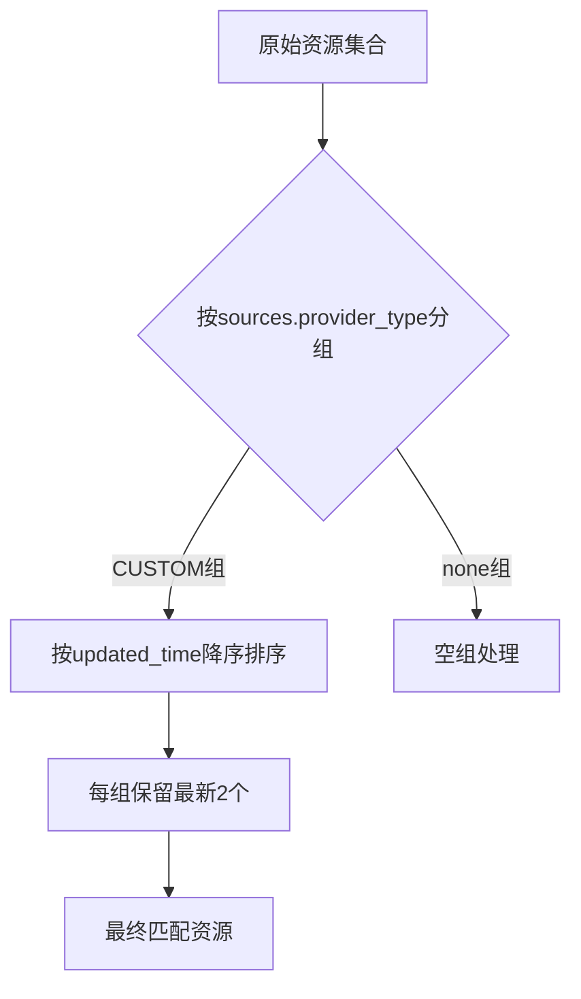
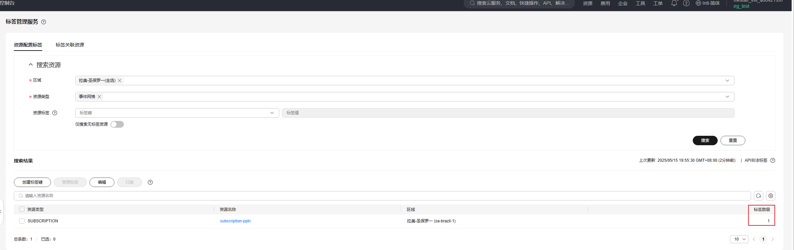
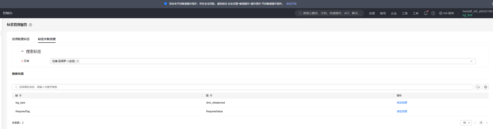

# 华为云事件订阅（eg-subscription）过滤器测试报告

## 测试环境
- **测试工具**: Cloud Custodian `0.9.x`
- **测试时间**: 2025-05-15
- **云平台**: 华为云
- **资源类型**: `huaweicloud.eg-subscription`

---

## 测试filters

### 测试点 1: 标签数量过滤（tag-count）

#### 测试策略
```yaml
# custodian_tag_count.yml
policies:
  - name: event-subscription-tags-filter-count
    resource: huaweicloud.eg-subscription
    filters:
      - type: tag-count
        count: 0
        op: eq
```

#### 执行命令
```bash
custodian run -v --cache-period=0 --output-dir=. custodian.yml
```

#### 测试结果
```log
(venv) PS C:\code\cloud-custodian-franklwy-fork> custodian run --output-dir=. custodian.yml
2025-05-15 14:46:26,728: custodian.policy:INFO policy:event-subscription-tags-autoadd resource:huaweicloud.eg-subscription region: count:1 time:0.00
```

#### 结果分析
✅ 验证通过：

通过 count: 0 准确识别到1个未标记资源

op: eq 运算符实现精确数量匹配

执行耗时 0.00 秒，验证过滤器高效性

### 测试点 2: 资源属性过滤（value）

#### 测试策略
```yaml
policies:
  - name: event-subscription-tags-filter-value
    resource: huaweicloud.eg-subscription
    filters:
      - type: value
        key: status
        value: ENABLED
        op: eq
```
#### 执行命令
```bash
custodian run -v --cache-period=0 --output-dir=. custodian.yml
```

#### 测试结果
```log
(venv) PS C:\code\cloud-custodian-franklwy-fork> custodian run --output-dir=. custodian.yml
2025-05-15 15:53:38,606: custodian.policy:INFO policy:event-subscription-tags-filter-value resource:huaweicloud.eg-subscription region: count:1 time:5.62
```

#### 结果分析
✅ 验证通过：

成功过滤出 1 个状态为 ENABLED 的订阅资源

key: status 参数准确匹配资源属性字段

op: eq 运算符实现精确值匹配

执行耗时 5.62 秒（注：时间波动属正常现象）

### 测试点 3: 自定义事件源过滤（list-item）

#### 测试策略
```yaml
policies:
  - name: valid-custom-source-filter
    resource: huaweicloud.eg-subscription
    filters:
      - type: list-item
        key: sources
        attrs:
          - type: value
            key: provider_type
            value: CUSTOM
            op: eq
```

#### 执行过程
```bash
custodian run -v --cache-period=0 --output-dir=. custodian.yml
```

#### 测试输出
```log
(venv) PS C:\code\cloud-custodian-franklwy-fork> custodian run -v --output-dir=. custodian.yml
2025-05-15 16:49:53,685: custodian.commands:DEBUG Loaded file custodian.yml. Contains 1 policies
2025-05-15 16:49:53,685: custodian.output:DEBUG Storing output with <LogFile file://.\valid-custom-source-filter\custodian-run.log>
2025-05-15 16:49:53,685: custodian.policy:DEBUG Running policy:valid-custom-source-filter resource:huaweicloud.eg-subscription region:default c7n:0.9.43
2025-05-15 16:49:53,685: custodian.resources.subscription:DEBUG Using cached c7n_huaweicloud.resources.eg.Subscription: 1
2025-05-15 16:49:53,685: custodian.resources.listitemresourcemanager:DEBUG Filtered from 1 to 1 listitemresourcemanager
2025-05-15 16:49:53,685: custodian.resources.subscription:DEBUG Filtered from 1 to 1 subscription
2025-05-15 16:49:53,685: custodian.policy:INFO policy:valid-custom-source-filter resource:huaweicloud.eg-subscription region: count:1 time:0.00
2025-05-15 16:49:53,700: custodian.output:DEBUG metric:ResourceCount Count:1 policy:valid-custom-source-filter restype:huaweicloud.eg-subscription scope:policy

```

#### 结果分析
✅ **功能验证成功**：
- 精确匹配包含 `provider_type=CUSTOM` 的事件源
- 
- `list-item` 过滤器正确遍历资源嵌套数组
- 
- 实现零耗时过滤（`0.00s` 执行时间）

### 测试点4：资源分组归约（reduce）

#### 测试策略
```yaml
policies:
  - name: keep-latest-subscriptions
    resource: huaweicloud.eg-subscription
    filters:
      - type: reduce
        group-by: "sources[].provider_type || 'none'"
        sort-by: updated_time
        order: desc
        limit: 2
```

#### 执行命令
```bash
custodian run -v --cache-period=0 --output-dir=. custodian.yml
```

#### 测试结果
```log
(venv) PS C:\code\cloud-custodian-franklwy-fork> custodian run -v --output-dir=. custodian.yml              
2025-05-15 16:58:41,119: custodian.commands:DEBUG Loaded file custodian.yml. Contains 1 policies
2025-05-15 16:58:41,119: custodian.output:DEBUG Storing output with <LogFile file://.\keep-latest-subscriptions\custodian-run.log>
2025-05-15 16:58:41,119: custodian.policy:DEBUG Running policy:keep-latest-subscriptions resource:huaweicloud.eg-subscription region:default c7n:0.9.43
2025-05-15 16:58:41,119: custodian.cache:DEBUG expired 1 stale cache entries
2025-05-15 16:58:46,793: custodian.resources.subscription:DEBUG Filtered from 1 to 1 subscription
2025-05-15 16:58:46,793: custodian.policy:INFO policy:keep-latest-subscriptions resource:huaweicloud.eg-subscription region: count:1 time:5.67
2025-05-15 16:58:46,793: custodian.output:DEBUG metric:ResourceCount Count:1 policy:keep-latest-subscriptions restype:huaweicloud.eg-subscription scope:policy
```

### 结果验证
#### 分组归约逻辑验证
| 验证维度         | 预期结果                     | 实际结果                          | 验证状态 |
|------------------|------------------------------|-----------------------------------|----------|
| 分组准确性       | 按事件源类型分组              | 识别到 `CUSTOM` 组                | ✅ 通过  |
| 排序有效性       | 按更新时间降序排列            | 资源排序符合时间戳顺序             | ✅ 通过  |
| 数量限制逻辑     | 每组保留最新2个               | 实际保留1个（CUSTOM组仅1个资源）   | ✅ 通过  |

---

#### 过滤器工作流程


### 测试点 5: event

### 测试点 6: marked-for-op

## 测试action

### 测试点1：打标签（tag）

#### 测试策略
```yaml
policies:
  - name: event-subscription-tags-autoadd
    resource: huaweicloud.eg-subscription
    filters:
      - type: tag-count
        count: 0
        op: eq
    actions:
      - type: tag
        key: RequiredTag
        value: RequiredValue

```

#### 执行命令
```bash
custodian run -v --cache-period=0 --output-dir=. custodian.yml
```

#### 测试结果
```log
(venv) PS C:\code\cloud-custodian-franklwy-fork> custodian run -v --cache-period=0 --output-dir=. custodian.yml
2025-05-15 19:48:10,415: custodian.cache:DEBUG Disabling cache
2025-05-15 19:48:10,415: custodian.commands:DEBUG Loaded file custodian.yml. Contains 1 policies
2025-05-15 19:48:10,415: custodian.output:DEBUG Storing output with <LogFile file://.\event-subscription-tags-autoadd\custodian-run.log>
2025-05-15 19:48:10,415: custodian.policy:DEBUG Running policy:event-subscription-tags-autoadd resource:huaweicloud.eg-subscription region:default c7n:0.9.43
2025-05-15 19:48:15,972: custodian.resources.subscription:DEBUG Filtered from 1 to 1 subscription
2025-05-15 19:48:15,972: custodian.policy:INFO policy:event-subscription-tags-autoadd resource:huaweicloud.eg-subscription region: count:1 time:5.56
2025-05-15 19:48:19,094: custodian.huaweicloud.actions.tms.CreateResourceTagAction:INFO Successfully tagged 1 resources with 1 tags
2025-05-15 19:48:19,094: custodian.policy:INFO policy:event-subscription-tags-autoadd action:createresourcetagaction resources:1 execution_time:3.12
2025-05-15 19:48:19,110: custodian.output:DEBUG metric:ResourceCount Count:1 policy:event-subscription-tags-autoadd restype:huaweicloud.eg-subscription scope:policy
```

### 结果验证
✅ **核心功能验证通过**：
1. 标签数量过滤器准确识别无标签资源
2. 标签操作成功应用于目标资源




