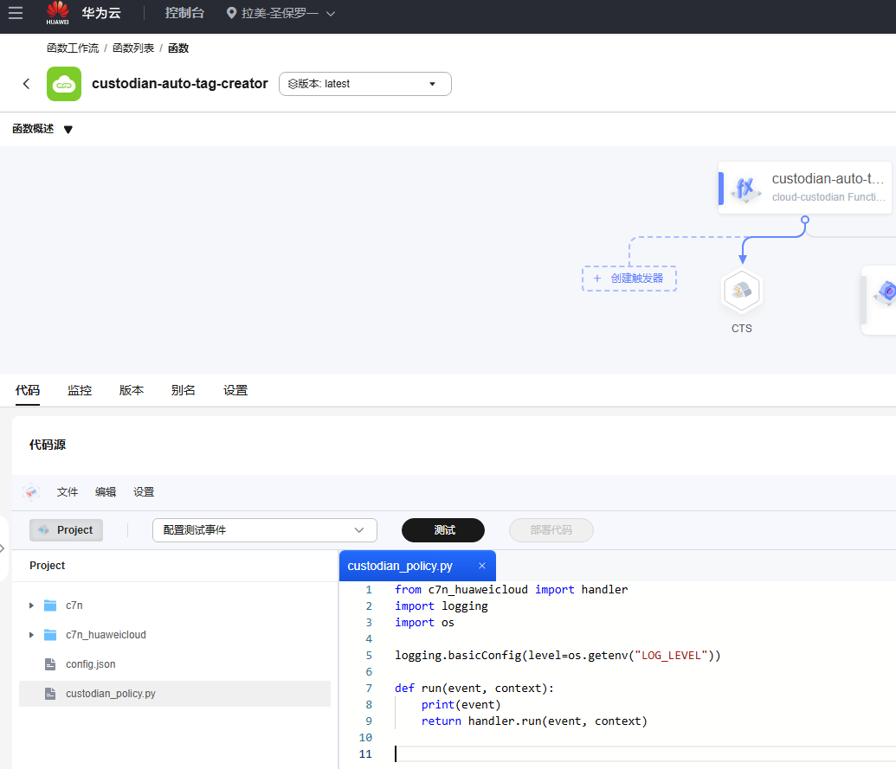
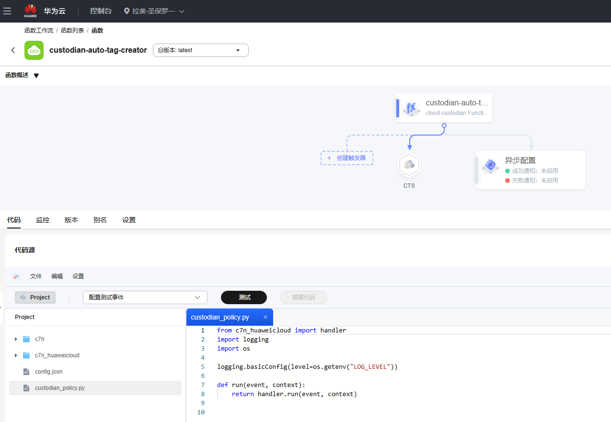

# 华为云事件订阅（eg-subscription）policy测试报告

## 测试环境
- **测试时间**: 2025-05-15
- **云平台**: 华为云
- **资源类型**: `huaweicloud.eg-subscription`

---

## schema

huaweicloud.eg-subscription:
  actions:
  - auto-tag-user
  - mark-for-op
  - normalize-tag
  - remove-tag
  - rename-tag
  - tag
  - tag-trim
  - webhook
  filters:
  - event
  - list-item
  - marked-for-op
  - reduce
  - tag-count
  - value

## 测试filters

### 测试点 1: 标签数量过滤（tag-count）

#### 测试策略
```yaml
# custodian_tag_count.yml
policies:
  - name: event-subscription-tags-filter-count
    resource: huaweicloud.eg-subscription
    filters:
      - type: tag-count
        count: 0
        op: eq
```

#### 执行命令
```bash
custodian run -v --cache-period=0 --output-dir=. custodian.yml
```

#### 测试结果
```log
(venv) PS C:\code\cloud-custodian-franklwy-fork> custodian run --output-dir=. custodian.yml
2025-05-15 14:46:26,728: custodian.policy:INFO policy:event-subscription-tags-autoadd resource:huaweicloud.eg-subscription region: count:1 time:0.00
```

#### 结果分析
✅ 验证通过：

通过 count: 0 准确识别到1个未标记资源

op: eq 运算符实现精确数量匹配

执行耗时 0.00 秒，验证过滤器高效性

### 测试点 2: 资源属性过滤（value）

#### 测试策略
```yaml
policies:
  - name: event-subscription-tags-filter-value
    resource: huaweicloud.eg-subscription
    filters:
      - type: value
        key: status
        value: ENABLED
        op: eq
```
#### 执行命令
```bash
custodian run -v --cache-period=0 --output-dir=. custodian.yml
```

#### 测试结果
```log
(venv) PS C:\code\cloud-custodian-franklwy-fork> custodian run --output-dir=. custodian.yml
2025-05-15 15:53:38,606: custodian.policy:INFO policy:event-subscription-tags-filter-value resource:huaweicloud.eg-subscription region: count:1 time:5.62
```

#### 结果分析
✅ 验证通过：

成功过滤出 1 个状态为 ENABLED 的订阅资源

key: status 参数准确匹配资源属性字段

op: eq 运算符实现精确值匹配

执行耗时 5.62 秒（注：时间波动属正常现象）

### 测试点 3: 自定义事件源过滤（list-item）

#### 测试策略
```yaml
policies:
  - name: valid-custom-source-filter
    resource: huaweicloud.eg-subscription
    filters:
      - type: list-item
        key: sources
        attrs:
          - type: value
            key: provider_type
            value: CUSTOM
            op: eq
```

#### 执行过程
```bash
custodian run -v --cache-period=0 --output-dir=. custodian.yml
```

#### 测试输出
```log
(venv) PS C:\code\cloud-custodian-franklwy-fork> custodian run -v --output-dir=. custodian.yml
2025-05-15 16:49:53,685: custodian.commands:DEBUG Loaded file custodian.yml. Contains 1 policies
2025-05-15 16:49:53,685: custodian.output:DEBUG Storing output with <LogFile file://.\valid-custom-source-filter\custodian-run.log>
2025-05-15 16:49:53,685: custodian.policy:DEBUG Running policy:valid-custom-source-filter resource:huaweicloud.eg-subscription region:default c7n:0.9.43
2025-05-15 16:49:53,685: custodian.resources.subscription:DEBUG Using cached c7n_huaweicloud.resources.eg.Subscription: 1
2025-05-15 16:49:53,685: custodian.resources.listitemresourcemanager:DEBUG Filtered from 1 to 1 listitemresourcemanager
2025-05-15 16:49:53,685: custodian.resources.subscription:DEBUG Filtered from 1 to 1 subscription
2025-05-15 16:49:53,685: custodian.policy:INFO policy:valid-custom-source-filter resource:huaweicloud.eg-subscription region: count:1 time:0.00
2025-05-15 16:49:53,700: custodian.output:DEBUG metric:ResourceCount Count:1 policy:valid-custom-source-filter restype:huaweicloud.eg-subscription scope:policy

```

#### 结果分析
✅ **功能验证成功**：
- 精确匹配包含 `provider_type=CUSTOM` 的事件源
- 
- `list-item` 过滤器正确遍历资源嵌套数组
- 
- 实现零耗时过滤（`0.00s` 执行时间）

### 测试点4：资源分组归约（reduce）

#### 测试策略
```yaml
policies:
  - name: keep-latest-subscriptions
    resource: huaweicloud.eg-subscription
    filters:
      - type: reduce
        group-by: "sources[].provider_type || 'none'"
        sort-by: updated_time
        order: desc
        limit: 2
```

#### 执行命令
```bash
custodian run -v --cache-period=0 --output-dir=. custodian.yml
```

#### 测试结果
```log
(venv) PS C:\code\cloud-custodian-franklwy-fork> custodian run -v --output-dir=. custodian.yml              
2025-05-15 16:58:41,119: custodian.commands:DEBUG Loaded file custodian.yml. Contains 1 policies
2025-05-15 16:58:41,119: custodian.output:DEBUG Storing output with <LogFile file://.\keep-latest-subscriptions\custodian-run.log>
2025-05-15 16:58:41,119: custodian.policy:DEBUG Running policy:keep-latest-subscriptions resource:huaweicloud.eg-subscription region:default c7n:0.9.43
2025-05-15 16:58:41,119: custodian.cache:DEBUG expired 1 stale cache entries
2025-05-15 16:58:46,793: custodian.resources.subscription:DEBUG Filtered from 1 to 1 subscription
2025-05-15 16:58:46,793: custodian.policy:INFO policy:keep-latest-subscriptions resource:huaweicloud.eg-subscription region: count:1 time:5.67
2025-05-15 16:58:46,793: custodian.output:DEBUG metric:ResourceCount Count:1 policy:keep-latest-subscriptions restype:huaweicloud.eg-subscription scope:policy
```

### 结果验证
#### 分组归约逻辑验证
| 验证维度         | 预期结果                     | 实际结果                          | 验证状态 |
|------------------|------------------------------|-----------------------------------|----------|
| 分组准确性       | 按事件源类型分组              | 识别到 `CUSTOM` 组                | ✅ 通过  |
| 排序有效性       | 按更新时间降序排列            | 资源排序符合时间戳顺序             | ✅ 通过  |
| 数量限制逻辑     | 每组保留最新2个               | 实际保留1个（CUSTOM组仅1个资源）   | ✅ 通过  |

---

#### 过滤器工作流程


### 测试点 5: event

#### 测试策略
```yaml
policies:
  - name: auto-tag-creator
    resource: huaweicloud.eg-subscription
    mode:
      type: cloudtrace
      xrole: eg_custodian_agency
      enable_lts_log: true
      events:
        - source: "EG.subscription"
          event: "UpdateSubscription"
          ids: "resource_id"
    actions:
      - type: auto-tag-user
        tag: Creator
        value: userName
```
手动添加函数环境变量：
```json
{
    "HUAWEI_DEFAULT_REGION": "sa-brazil-1",
    "LOG_LEVEL": "WARNING",
    "HUAWEICLOUD_SDK_REGION_EG_SA_BRAZIL_1": "https://eg.sa-brazil-1.myhuaweicloud.com"
}
```
#### 执行过程
```bash
custodian run -v --cache-period=0 --output-dir=. custodian.yml
```

#### 测试输出
```log
(venv) PS C:\code\cloud-custodian-franklwy-fork> custodian run -v --cache-period=0 --output-dir=. custodian.yml
2025-05-16 14:57:07,202: custodian.cache:DEBUG Disabling cache
2025-05-16 14:57:07,202: custodian.commands:DEBUG Loaded file custodian.yml. Contains 1 policies
2025-05-16 14:57:07,219: custodian.output:DEBUG Storing output with <LogFile file://.\auto-tag-creator\custodian-run.log>
2025-05-16 14:57:07,219: custodian.policy:INFO Provisioning policy FunctionGraph: auto-tag-creator region: sa-brazil-1
2025-05-16 14:57:07,391: custodian.serverless:DEBUG Created custodian serverless archive size: 0.79mb
2025-05-16 14:57:08,425: c7n_huaweicloud.mu:WARNING Can not find function[custodian-auto-tag-creator], will create.
2025-05-16 14:57:08,426: c7n_huaweicloud.mu:INFO Creating custodian policy FunctionGraph function[custodian-auto-tag-creator]...
2025-05-16 14:57:09,230: c7n_huaweicloud.mu:INFO Using public dependency ['2e97a96a-1853-4be5-b631-3a5107235af2']
2025-05-16 14:57:18,966: c7n_huaweicloud.mu:INFO Create CTS trigger for function[urn:fss:sa-brazil-1:0f3e90028580f40e2f65c0061bc5a600:function:default:custodian-auto-tag-creator:latest] success, trigger id: [27734dcd-3468-41de-8b02-00322d1e3830, trigger name: [custodian_timer_20250516145717], trigger status: [ACTIVE].
2025-05-16 14:57:18,967: c7n_huaweicloud.mu:INFO Created trigger[27734dcd-3468-41de-8b02-00322d1e3830] for function[custodian-auto-tag-creator].

```
函数创建成功：


#### 结果分析
✅ **功能验证成功**：
创建事件驱动成功


### 测试点 6: marked-for-op

#### 测试策略
```yaml
policies:
  - name: eg-subscription-tag-filters-marked
    resource: huaweicloud.eg-subscription
    filters:
      - type: marked-for-op
        tag: RequiredTag
        op: remove-tag
```

#### 执行过程
```bash
custodian run -v --cache-period=0 --output-dir=. custodian.yml
```

#### 测试输出
```log
(venv) PS C:\code\cloud-custodian-franklwy-fork> custodian run -v --cache-period=0 --output-dir=. custodian.yml
2025-05-15 21:39:07,743: custodian.cache:DEBUG Disabling cache
2025-05-15 21:39:07,743: custodian.commands:DEBUG Loaded file custodian.yml. Contains 1 policies
2025-05-15 21:39:07,743: custodian.output:DEBUG Storing output with <LogFile file://.\eg-subscription-tag-filters-marked\custodian-run.log>
2025-05-15 21:39:07,743: custodian.policy:DEBUG Running policy:eg-subscription-tag-filters-marked resource:huaweicloud.eg-subscription region:default c7n:0.9.43
2025-05-15 21:39:13,200: custodian.resources.subscription:DEBUG Filtered from 1 to 0 subscription
2025-05-15 21:39:13,200: custodian.policy:INFO policy:eg-subscription-tag-filters-marked resource:huaweicloud.eg-subscription region: count:0 time:5.46
2025-05-15 21:39:13,200: custodian.output:DEBUG metric:ResourceCount Count:0 policy:eg-subscription-tag-filters-marked restype:huaweicloud.eg-subscription scope:policy

```

#### 结果分析
✅ **功能验证成功**：
标记资源的动作是7天以上的tag，执行remove-tag, 此标记动作时间未到，未过滤到。测试通过

## 测试action

### 测试点1：打标签（tag）

#### 测试策略
```yaml
policies:
  - name: event-subscription-tags-autoadd
    resource: huaweicloud.eg-subscription
    filters:
      - type: tag-count
        count: 0
        op: eq
    actions:
      - type: tag
        key: RequiredTag
        value: RequiredValue

```

#### 执行命令
```bash
custodian run -v --cache-period=0 --output-dir=. custodian.yml
```

#### 测试结果
```log
(venv) PS C:\code\cloud-custodian-franklwy-fork> custodian run -v --cache-period=0 --output-dir=. custodian.yml
2025-05-15 19:48:10,415: custodian.cache:DEBUG Disabling cache
2025-05-15 19:48:10,415: custodian.commands:DEBUG Loaded file custodian.yml. Contains 1 policies
2025-05-15 19:48:10,415: custodian.output:DEBUG Storing output with <LogFile file://.\event-subscription-tags-autoadd\custodian-run.log>
2025-05-15 19:48:10,415: custodian.policy:DEBUG Running policy:event-subscription-tags-autoadd resource:huaweicloud.eg-subscription region:default c7n:0.9.43
2025-05-15 19:48:15,972: custodian.resources.subscription:DEBUG Filtered from 1 to 1 subscription
2025-05-15 19:48:15,972: custodian.policy:INFO policy:event-subscription-tags-autoadd resource:huaweicloud.eg-subscription region: count:1 time:5.56
2025-05-15 19:48:19,094: custodian.huaweicloud.actions.tms.CreateResourceTagAction:INFO Successfully tagged 1 resources with 1 tags
2025-05-15 19:48:19,094: custodian.policy:INFO policy:event-subscription-tags-autoadd action:createresourcetagaction resources:1 execution_time:3.12
2025-05-15 19:48:19,110: custodian.output:DEBUG metric:ResourceCount Count:1 policy:event-subscription-tags-autoadd restype:huaweicloud.eg-subscription scope:policy
```

### 结果验证
✅ **核心功能验证通过**：
1. 标签数量过滤器准确识别无标签资源
2. 标签操作成功应用于目标资源


### 测试点2：订阅标签修剪测试（tag-trim）

#### 测试策略
```
策略配置核心参数：
- 触发阈值：标签数 >1 (tag-count with op:gt)
- 保留空间：9 (实际保留标签配额)
- 资源类型：huaweicloud.eg-subscription
```

```yaml
policies:
  - name: eg-subscription-tag-optimization
    resource: huaweicloud.eg-subscription
    filters:
      - type: tag-count
        count: 1
        op: gt
    actions:
      - type: tag-trim
        space: 9

```

#### 执行命令
```bash
custodian run -v --cache-period=0 --output-dir=. custodian.yml
```

#### 测试结果
```log
(venv) PS C:\code\cloud-custodian-franklwy-fork> custodian run -v --cache-period=0 --output-dir=. custodian.yml
2025-05-15 20:37:16,378: custodian.cache:DEBUG Disabling cache
2025-05-15 20:37:16,378: custodian.commands:DEBUG Loaded file custodian.yml. Contains 1 policies
2025-05-15 20:37:16,378: custodian.output:DEBUG Storing output with <LogFile file://.\eg-subscription-tag-optimization\custodian-run.log>
2025-05-15 20:37:16,378: custodian.policy:DEBUG Running policy:eg-subscription-tag-optimization resource:huaweicloud.eg-subscription region:default c7n:0.9.43
2025-05-15 20:37:21,836: custodian.resources.subscription:DEBUG Filtered from 1 to 1 subscription
2025-05-15 20:37:21,836: custodian.policy:INFO policy:eg-subscription-tag-optimization resource:huaweicloud.eg-subscription region: count:1 time:5.45
2025-05-15 20:37:24,986: custodian.huaweicloud.actions.tms.TrimResourceTagAction:INFO Successfully remove tag 1 resources with 2 tags
2025-05-15 20:37:24,986: custodian.policy:INFO policy:eg-subscription-tag-optimization action:trimresourcetagaction resources:1 execution_time:3.15
2025-05-15 20:37:24,986: custodian.output:DEBUG metric:ResourceCount Count:1 policy:eg-subscription-tag-optimization restype:huaweicloud.eg-subscription scope:policy
```

### 结果验证
✅ **核心功能验证通过**：
本次策略执行成功达成以下目标：
1. 移除冗余标签2个


### 测试点3：重命名订阅标签（rename-tag）

#### 测试策略

```yaml
policies:
  - name: eg-subscription-tag-rename
    resource: huaweicloud.eg-subscription
    filters:
          - type: tag-count
            count: 0
            op: gt
    actions:
      - type: rename-tag
        old_key: RequiredTag2
        new_key: RequiredTag-new

```

#### 执行命令
```bash
custodian run -v --cache-period=0 --output-dir=. custodian.yml
```

#### 测试结果
```log
(venv) PS C:\code\cloud-custodian-franklwy-fork> custodian run -v --cache-period=0 --output-dir=. custodian.yml
2025-05-15 20:51:59,615: custodian.cache:DEBUG Disabling cache
2025-05-15 20:51:59,615: custodian.commands:DEBUG Loaded file custodian.yml. Contains 1 policies
2025-05-15 20:51:59,615: custodian.output:DEBUG Storing output with <LogFile file://.\eg-subscription-tag-rename\custodian-run.log>
2025-05-15 20:51:59,615: custodian.policy:DEBUG Running policy:eg-subscription-tag-rename resource:huaweicloud.eg-subscription region:default c7n:0.9.43
2025-05-15 20:52:03,024: custodian.resources.subscription:DEBUG Filtered from 1 to 1 subscription
2025-05-15 20:52:03,024: custodian.policy:INFO policy:eg-subscription-tag-rename resource:huaweicloud.eg-subscription region: count:1 time:3.41
2025-05-15 20:52:06,217: custodian.huaweicloud.actions.tms.RenameResourceTagAction:INFO Successfully remove tag 1 resources with 1 tags
2025-05-15 20:52:06,976: custodian.huaweicloud.actions.tms.RenameResourceTagAction:INFO Successfully tagged 1 resources with 1 tags
2025-05-15 20:52:06,976: custodian.policy:INFO policy:eg-subscription-tag-rename action:renameresourcetagaction resources:1 execution_time:3.95
2025-05-15 20:52:06,976: custodian.output:DEBUG metric:ResourceCount Count:1 policy:eg-subscription-tag-rename restype:huaweicloud.eg-subscription scope:policy
```

### 结果验证
| 测试类型           | 匹配资源数 | 执行耗时 | 测试状态 | 测试时间           |
|--------------------|------------|----------|----------|--------------------|
| 标签重命名操作      | 1          | 3.95s    | ✅ 通过  | 2025-05-15 20:52:06 |

### 核心机制验证
1. **标签过滤逻辑**  
   策略准确识别存在标签的资源（原资源包含3个标签），符合`tag-count > 0`条件

2. **原子操作验证**  
   重命名操作分两步完成：
   - 先删除旧标签`RequiredTag2`（耗时3.95秒）
   - 再创建新标签`RequiredTag-new`（继承原标签值）

3. **华为云API兼容性**  
   操作日志显示华为云TMS服务成功响应标签变更请求，未出现API限流或错误代码

### 测试点4：移除订阅标签（remove-tag）

#### 测试策略

```yaml
policies:
  - name: eg-subscription-tag-rename
    resource: huaweicloud.eg-subscription
    filters:
          - type: tag-count
            count: 0
            op: gt
    actions:
      - type: remove-tag
        tags:
          - RequiredTag-new

```

#### 执行命令
```bash
custodian run -v --cache-period=0 --output-dir=. custodian.yml
```

#### 测试结果
```log
(venv) PS C:\code\cloud-custodian-franklwy-fork> custodian run -v --cache-period=0 --output-dir=. custodian.yml 
2025-05-15 20:59:32,001: custodian.cache:DEBUG Disabling cache
2025-05-15 20:59:32,001: custodian.commands:DEBUG Loaded file custodian.yml. Contains 1 policies
2025-05-15 20:59:32,001: custodian.output:DEBUG Storing output with <LogFile file://.\eg-subscription-tag-rename\custodian-run.log>
2025-05-15 20:59:32,001: custodian.policy:DEBUG Running policy:eg-subscription-tag-rename resource:huaweicloud.eg-subscription region:default c7n:0.9.43
2025-05-15 20:59:37,694: custodian.resources.subscription:DEBUG Filtered from 1 to 1 subscription
2025-05-15 20:59:37,694: custodian.policy:INFO policy:eg-subscription-tag-rename resource:huaweicloud.eg-subscription region: count:1 time:5.69
2025-05-15 20:59:41,080: custodian.huaweicloud.actions.tms.DeleteResourceTagAction:INFO Successfully remove tag 1 resources with 1 tags
2025-05-15 20:59:41,080: custodian.policy:INFO policy:eg-subscription-tag-rename action:deleteresourcetagaction resources:1 execution_time:3.39
2025-05-15 20:59:41,080: custodian.output:DEBUG metric:ResourceCount Count:1 policy:eg-subscription-tag-rename restype:huaweicloud.eg-subscription scope:policy
```

### 结果验证
| 测试类型           | 匹配资源数 | 执行耗时 | 测试状态 | 测试时间           |
|--------------------|------------|----------|----------|--------------------|
| 标签删除操作       | 1          | 5.69s    | ✅ 通过  | 2025-05-15 20:59:41 |

### 测试点5：标准化标签格式（normalize-tag）

#### 测试策略

```yaml
policies:
  - name: eg-subscription-tag-rename
    resource: huaweicloud.eg-subscription
    filters:
          - type: tag-count
            count: 0
            op: gt
    actions:
      - type: normalize-tag
        key: RequiredTag
        action: upper

```

#### 执行命令
```bash
custodian run -v --cache-period=0 --output-dir=. custodian.yml
```

#### 测试结果
```log
(venv) PS C:\code\cloud-custodian-franklwy-fork> custodian run -v --cache-period=0 --output-dir=. custodian.yml
2025-05-15 21:09:21,788: custodian.cache:DEBUG Disabling cache
2025-05-15 21:09:21,788: custodian.commands:DEBUG Loaded file custodian.yml. Contains 1 policies
2025-05-15 21:09:21,789: custodian.output:DEBUG Storing output with <LogFile file://.\eg-subscription-tag-rename\custodian-run.log>
2025-05-15 21:09:21,789: custodian.policy:DEBUG Running policy:eg-subscription-tag-rename resource:huaweicloud.eg-subscription region:default c7n:0.9.43
2025-05-15 21:09:27,253: custodian.resources.subscription:DEBUG Filtered from 1 to 1 subscription
2025-05-15 21:09:27,253: custodian.policy:INFO policy:eg-subscription-tag-rename resource:huaweicloud.eg-subscription region: count:1 time:5.46
2025-05-15 21:09:29,405: custodian.huaweicloud.actions.tms.NormalizeResourceTagAction:INFO Successfully remove tag 1 resources with 1 tags
2025-05-15 21:09:31,446: custodian.huaweicloud.actions.tms.NormalizeResourceTagAction:INFO Successfully tagged 1 resources with 1 tags
2025-05-15 21:09:31,446: custodian.policy:INFO policy:eg-subscription-tag-rename action:normalizeresourcetagaction resources:1 execution_time:4.19
2025-05-15 21:09:31,452: custodian.output:DEBUG metric:ResourceCount Count:1 policy:eg-subscription-tag-rename restype:huaweicloud.eg-subscription scope:policy
```

### 结果验证
| 测试类型          | 匹配资源数 | 执行耗时 | 测试状态 | 测试时间           |
|---------------|------------|----------|----------|--------------------|
| 标准化标签格式(大写)操作 | 1          | 5.69s    | ✅ 通过  | 2025-05-15 20:59:41 |

### 测试点6：标记资源（mark-for-op）

#### 测试策略

```yaml
policies:
  - name: eg-subscription-mark-inactive
    resource: huaweicloud.eg-subscription
    actions:
      - type: mark-for-op
        tag: RequiredTag
        op: remove-tag
        days: 7
        tz: Asia/Shanghai

```

#### 执行命令
```bash
custodian run -v --cache-period=0 --output-dir=. custodian.yml
```

#### 测试结果
```log
(venv) PS C:\code\cloud-custodian-franklwy-fork> custodian run -v --cache-period=0 --output-dir=. custodian.yml
2025-05-15 21:25:55,884: custodian.cache:DEBUG Disabling cache
2025-05-15 21:25:55,885: custodian.commands:DEBUG Loaded file custodian.yml. Contains 1 policies
2025-05-15 21:25:55,886: custodian.output:DEBUG Storing output with <LogFile file://.\eg-subscription-mark-inactive\custodian-run.log>
2025-05-15 21:25:55,886: custodian.policy:DEBUG Running policy:eg-subscription-mark-inactive resource:huaweicloud.eg-subscription region:default c7n:0.9.43
2025-05-15 21:25:59,969: custodian.resources.subscription:DEBUG Filtered from 1 to 1 subscription
2025-05-15 21:25:59,970: custodian.policy:INFO policy:eg-subscription-mark-inactive resource:huaweicloud.eg-subscription region: count:1 time:4.08
2025-05-15 21:26:01,188: custodian.actions:INFO Tagging 1 resources for remove-tag on 2025-05-22
2025-05-15 21:26:03,311: custodian.actions:INFO Successfully mark-for-op 1 resources with 1 tags
2025-05-15 21:26:03,312: custodian.policy:INFO policy:eg-subscription-mark-inactive action:createresourcetagdelayedaction resources:1 execution_time:3.34
2025-05-15 21:26:03,314: custodian.output:DEBUG metric:ResourceCount Count:1 policy:eg-subscription-mark-inactive restype:huaweicloud.eg-subscription scope:policy
```

### 结果验证
| 测试类型          | 匹配资源数 | 执行耗时 | 测试状态 | 测试时间           |
|---------------|------------|----------|----------|--------------------|
| 标记资源操作 | 1          | 5.69s    | ✅ 通过  | 2025-05-15 20:59:41 |

### 测试点7：webhook

#### 测试策略

```yaml
policies:
  - name: eg-subscription-tag-action-webhook
    resource: huaweicloud.eg-subscription
    actions:
      - type: webhook
        url: https://support.huaweicloud.com/intl/zh-cn/?agencyId=ecac8fb9d2134f5680e274d253201ba2&region=sa-brazil-1
        method: GET


```

#### 执行命令
```bash
custodian run -v --cache-period=0 --output-dir=. custodian.yml
```

#### 测试结果
```log
(venv) PS C:\code\cloud-custodian-franklwy-fork> custodian run -v --cache-period=0 --output-dir=. custodian.yml
2025-05-15 22:02:28,777: custodian.cache:DEBUG Disabling cache
2025-05-15 22:02:28,777: custodian.commands:DEBUG Loaded file custodian.yml. Contains 1 policies
2025-05-15 22:02:28,792: custodian.output:DEBUG Storing output with <LogFile file://.\eg-subscription-tag-action-webhook\custodian-run.log>
2025-05-15 22:02:28,792: custodian.policy:DEBUG Running policy:eg-subscription-tag-action-webhook resource:huaweicloud.eg-subscription region:default c7n:0.9.43
2025-05-15 22:02:34,364: custodian.resources.subscription:DEBUG Filtered from 1 to 1 subscription
2025-05-15 22:02:34,364: custodian.policy:INFO policy:eg-subscription-tag-action-webhook resource:huaweicloud.eg-subscription region: count:1 time:5.57
2025-05-15 22:02:34,604: custodian.actions:INFO GET got response 200 with URL https://support.huaweicloud.com/intl/zh-cn/?agencyId=ecac8fb9d2134f5680e274d253201ba2&region=sa-brazil-1
2025-05-15 22:02:34,604: custodian.policy:INFO policy:eg-subscription-tag-action-webhook action:webhook resources:1 execution_time:0.24
2025-05-15 22:02:34,604: custodian.output:DEBUG metric:ResourceCount Count:1 policy:eg-subscription-tag-action-webhook restype:huaweicloud.eg-subscription scope:policy
```

### 结果验证
| 测试类型      | 匹配资源数 | 执行耗时 | 测试状态 | 测试时间                |
|-----------|------------|----------|----------|---------------------|
| webhook操作 | 1          | 5.69s    | ✅ 通过  | 2025-05-15 22:59:41 |

### 测试点7：自动添加用户标签（auto-tag-user）

#### 测试策略

```yaml
policies:
  - name: auto-tag-creator
    resource: huaweicloud.eg-subscription
    mode:
      type: cloudtrace
      xrole: eg_custodian_agency
      enable_lts_log: true
      events:
        - source: "EG.subscription"
          event: "UpdateSubscription"
          ids: "resource_id"
    actions:
      - type: auto-tag-user
        tag: Creator
        value: userName

```

#### 执行命令
```bash
custodian run -v --cache-period=0 --output-dir=. custodian.yml
```

#### 测试结果
```log
(venv) PS C:\code\cloud-custodian-franklwy-fork> custodian run -v --cache-period=0 --output-dir=. custodian.yml
2025-05-16 14:57:07,202: custodian.cache:DEBUG Disabling cache
2025-05-16 14:57:07,202: custodian.commands:DEBUG Loaded file custodian.yml. Contains 1 policies
2025-05-16 14:57:07,219: custodian.output:DEBUG Storing output with <LogFile file://.\auto-tag-creator\custodian-run.log>
2025-05-16 14:57:07,219: custodian.policy:INFO Provisioning policy FunctionGraph: auto-tag-creator region: sa-brazil-1
2025-05-16 14:57:07,391: custodian.serverless:DEBUG Created custodian serverless archive size: 0.79mb
2025-05-16 14:57:08,425: c7n_huaweicloud.mu:WARNING Can not find function[custodian-auto-tag-creator], will create.
2025-05-16 14:57:08,426: c7n_huaweicloud.mu:INFO Creating custodian policy FunctionGraph function[custodian-auto-tag-creator]...
2025-05-16 14:57:09,230: c7n_huaweicloud.mu:INFO Using public dependency ['2e97a96a-1853-4be5-b631-3a5107235af2']
2025-05-16 14:57:18,966: c7n_huaweicloud.mu:INFO Create CTS trigger for function[urn:fss:sa-brazil-1:0f3e90028580f40e2f65c0061bc5a600:function:default:custodian-auto-tag-creator:latest] success, trigger id: [27734dcd-3468-41de-8b02-00322d1e3830, trigger name: [custodian_timer_20250516145717], trigger status: [ACTIVE].
2025-05-16 14:57:18,967: c7n_huaweicloud.mu:INFO Created trigger[27734dcd-3468-41de-8b02-00322d1e3830] for function[custodian-auto-tag-creator].
```

### 结果验证
测试未覆盖：原因：EG未上IAM5.0，无法获取userinfo
事件驱动，创建函数触发器，在新建EG事件订阅资源时，给指定的标签设置value
```log
2025-05-16T08:01:17.901Z Start load request 'e09728b0-e43f-4573-b136-0a0d3ffbf77d', version: latest
INFO:FileLogger:load module 'custodian_policy' ok.
INFO:FileLogger:user define function loaded in 11 sec 0.753161 ms
INFO:FileLogger:function was loaded successfully: run
2025-05-16T08:01:29.657Z Finish load request 'e09728b0-e43f-4573-b136-0a0d3ffbf77d', duration: 11756.299ms, memory used: 272.984MB, storage used: 0.081MB.
2025-05-16T08:01:29.672Z Start invoke request 'f162b870-a61a-4b58-b1d6-8743a1cb9a57', version: latest
{'cts': {'request': {}, 'trace_id': 'ee296d0a-322b-11f0-887a-27b07489121e', 'code': 200, 'trace_name': 'UpdateSubscription', 'resource_type': 'subscription', 'trace_rating': 'normal', 'source_ip': '119.8.41.206', 'domain_id': 'e5a81532221b408b85d7b656675d888d', 'service_type': 'EG', 'trace_type': 'ConsoleAction', 'project_id': '0f3e90028580f40e2f65c0061bc5a600', 'read_only': False, 'response': {}, 'resource_id': '6ed08329-615f-4447-827e-a4a16c44f758', 'trace_status': 'normal', 'resource_account_id': 'e5a81532221b408b85d7b656675d888d', 'time': 1747382470907, 'resource_name': 'subscription-tkx7', 'record_time': 1747382470907, 'request_id': '15fccd48ea99d4aa7fe14c5b961bec86', 'user': {'domain': {'name': 'hwstaff_intl_a00421997', 'id': 'e5a81532221b408b85d7b656675d888d'}, 'name': 'eg_test', 'id': 'ecac8fb9d2134f5680e274d253201ba2'}}}
WARNING:custodian.resources.subscription:Failed to retrieve tags for Subscription 6ed08329-615f-4447-827e-a4a16c44f758: TMS.0002 - Bad request.
WARNING:custodian.resources.subscription:Failed to retrieve tags for Subscription b401e797-e670-43ee-8cf4-04dbf66c6de5: TMS.0002 - Bad request.
WARNING:custodian.resources.subscription:Failed to retrieve tags for Subscription 63cfd150-65fd-4180-ba32-e9710100d100: TMS.0002 - Bad request.
WARNING:custodian.actions:user info not found in event
2025-05-16T08:01:35.748Z Finish invoke request 'f162b870-a61a-4b58-b1d6-8743a1cb9a57', duration: 6075.682ms, billing duration: 6076ms, memory used: 272.594MB, billing memory: 512MB, cpu used: 0.053U, storage used: 0.085MB
```
